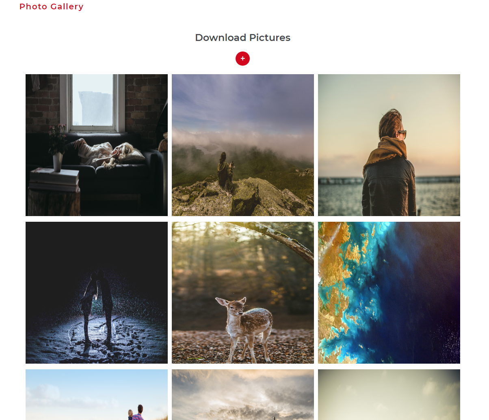

# :tada: Photo Gallery

 

  

## :pencil: Description

Photo Gallery is a simple gallery showing photos downloaded from the internet.
 
The app downloads 3 photos initially. User can use the button to fetch the next three which are then displayed on the page.
 
The application fetch list of photos from [Picsum](https://picsum.photos/v2/list).
 

## :wrench: Tools

**The following tools were used in project:**

- **React** - Main technology
- **Hooks** - use state and other React features without writing a class component
- **Framer Motion** - production-ready animation library.

## :construction_worker: Install

### `npm install`

Installs the necessary application dependencies

## Available Scripts

In the project directory, you can run:

### `npm start`

Runs the app in the development mode. 
Open [http://localhost:3000](http://localhost:3000) to view it in the browser.

### `npm run test`

Launches the test runner in the interactive watch mode.

## :movie_camera: Live

https://photo-gallery-aedf8.web.app/
